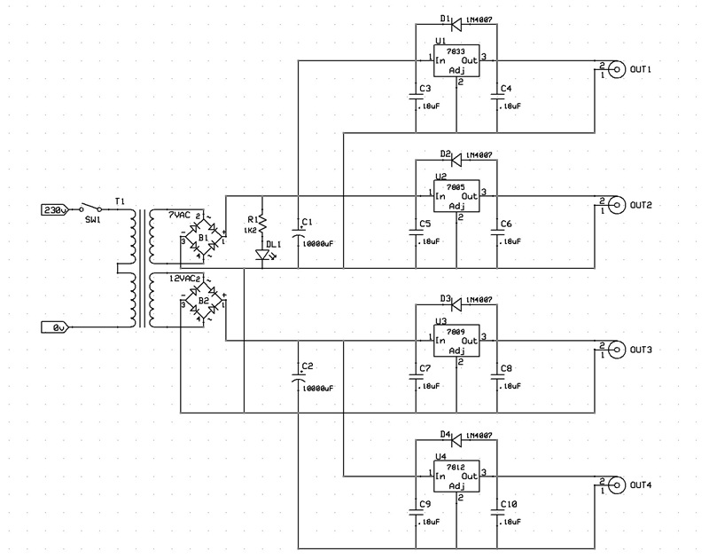

# Multi Out Power Supply Unit
A simple 4 output lines (3V3, 5V, 9V, 12V) power supply unit powered by the mains. 
The 3V3 and 5V output lines togheter carry a current up to 500mA.
The 9V and 12V output lines togheter carry a current up to 250mA.

## Specifications

### Features
- power source from mains
- 3V3-500mA regulated output line
- 5V-500mA regulated output line
- 9V-250mA regulated output line
- 12V-250mA regulated output line

### Hardware
Schematics and PCB layouts are designed with ExpressPCB free CAD software.

#### Schematic:

#### PCB Layout:

## About
Author : Alessandro Fraschetti (mail: [gos95@gommagomma.net](mailto:gos95@gommagomma.net))

## Licence
This project is under the [MIT license](LICENSE).
You are free to use this for any purpose, just try to give credit in the documentation of your project.
